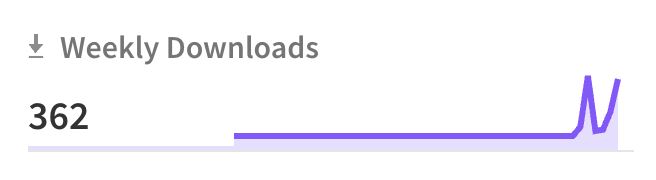
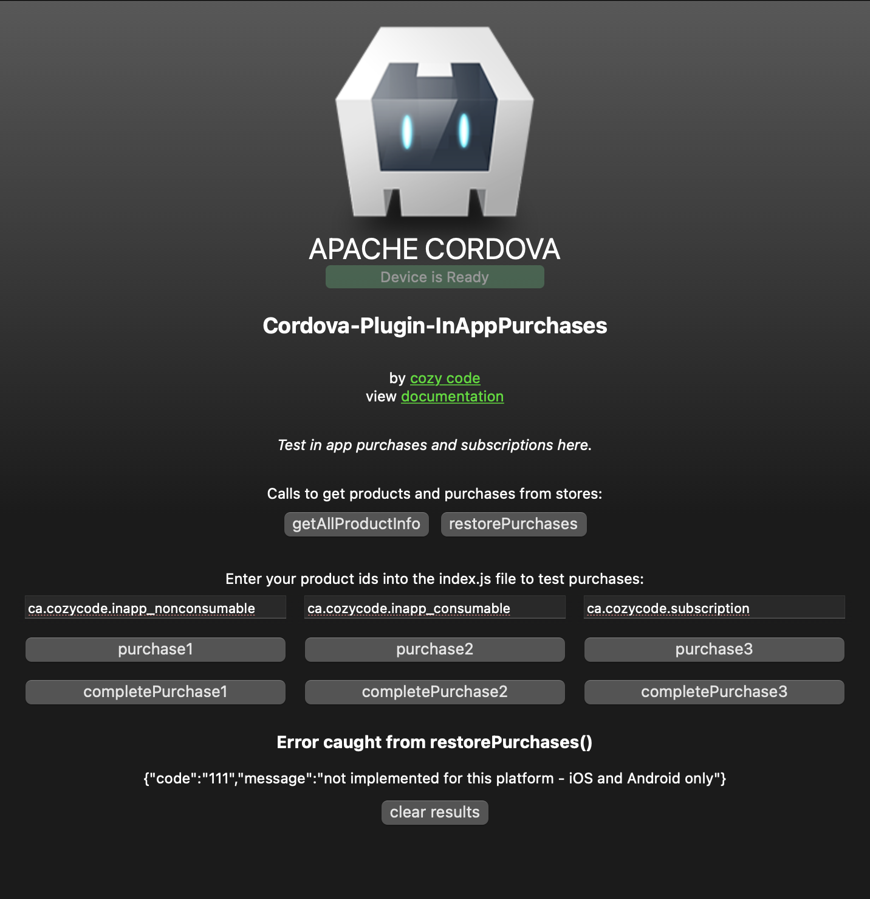
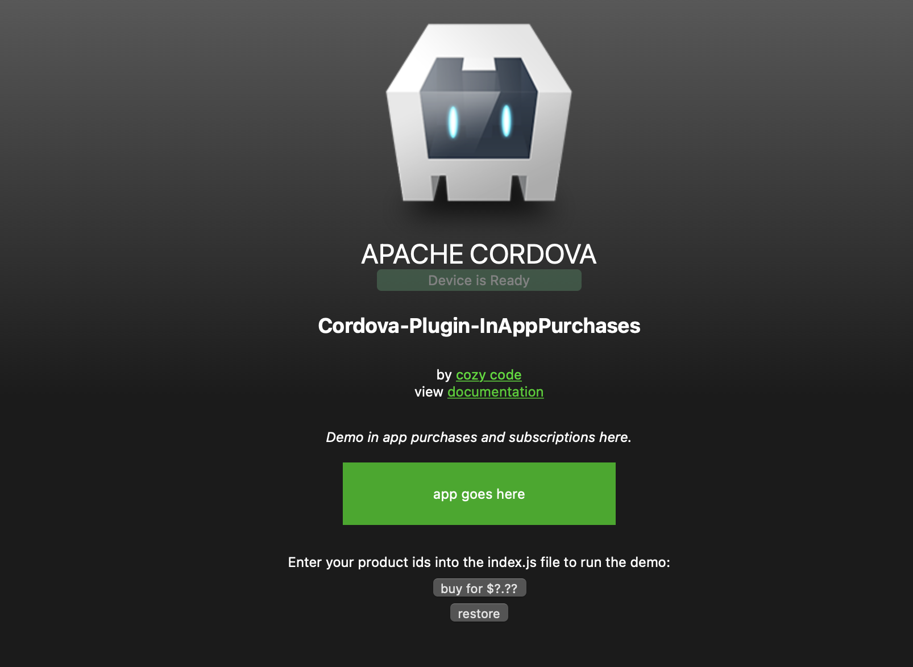
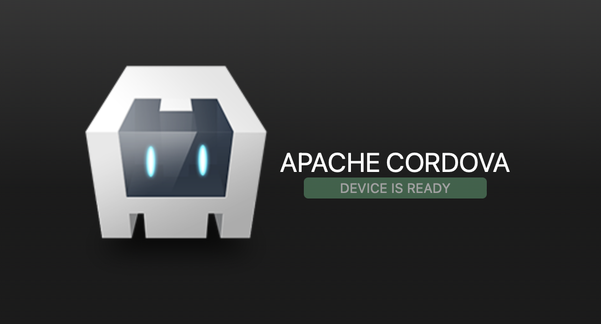

# Cordova-Plugin-InAppPurchases

jump to: [PLUGIN USAGE](#plugin-usage) | [Testing App](#testing-app) | [Demo App](#demo-app) | [Cordova](#create-app) | [ADD IN APP PURCHASES](#add-inapp) | [Testing Tips](#testing-tips) | [Future Improvements](#future) | [cozycode.ca](#more-cozycode) | [Open Source License](#license) 
<hr/>

***Cordova*** plugin to add ***in-app purchases*** (and ***subscriptions***) into an app. <br>
Use JavaScript to view, make, and complete purchases.

Updated __2023__ for [Cordova](https://cordova.apache.org/) with current:<br>
__Android__: *Billing Library 6* (released June 2023) (verifies receipts internally)<br>
__iOS__: *StoreKit* (not StoreKit 2, released 2021, which is only available for iOS 15 and up) (does not verify receipts currently - it returns them, and can be verified if needed)<br>
__Amazon Fire__: compatible, but untested <br>
__Browser__: not implemented<br>
__Windows__: not implemented <br>


<p align="center">

</p>
<p align="center">
Downloaded 50 - 500 times/week into apps.
<p>

If you notice any issues, submit here: [github issues](https://github.com/cozycodegh/cordova-plugin-inapppurchases/issues)<br>
Based on the original plugin working for many years made by Alex Disler (c) 2016 MIT, which is out of date for writing new apps: [`cordova-plugin-inapppurchase`](https://github.com/AlexDisler/cordova-plugin-inapppurchase)<br>
Forked from another plugin, which is kept updated as well, if this plugin is broken, try this plugin: [`cordova-plugin-inapppurchase2`](https://github.com/wccrawford/cordova-plugin-inapppurchase-2)<br>
This new plugin distribution makes significant changes to the Google Play Billing Library and plugin integration code.

Have a good one! :grinning:


# PLUGIN USAGE<a id="plugin-usage"></a><br>

Add these calls inside of your cordova JavaScript to make in-app purchases and subscriptions:

[`inAppPurchases.getAllProductInfo(productIds)`](docs/getAllProductInfo.md) <br>
[`inAppPurchases.restorePurchases()`](docs/restorePurchases.md)  <br>
[`inAppPurchases.purchase(productId)`](docs/purchase.md)  <br>
[`inAppPurchase.completePurchase(productId,consume)`](docs/completePurchase.md) <br>

The plugin creates an `inAppPurchases` object which can make calls to the store. <br>

[see how to add the plugin](#add-inapp)

[see more on using the plugin](docs/pluginAPI.md)

# Testing App<a id="testing-app"></a><br>

After creating [App Store and Google Play accounts and in-app products](#testing-tips), this app can test purchases. <br/>
Download test app here: [cordova-plugin-inapppurchases Test App](https://github.com/cozycodegh/cordova-plugin-inapppurchases_TESTAPP)
<p align="center">

</p>

# Demo App<a id="demo-app"></a><br>

This app shows how to use this plugin to load and make purchases in a [Cordova](https://cordova.apache.org/) app:<br/>
Download demo app here: [cordova-plugin-inapppurchases Demo App](https://github.com/cozycodegh/cordova-plugin-inapppurchases_DEMOAPP)
<p align="center">

</p>

# CREATE AN APP WITH CORDOVA<a id="create-app"></a><br>

How to create a Cordova app: <br>
```properties
npm install -g cordova
cordova create directory_name com.your_name_or_company.your_app_name
```
<p align="center">

</p>

Cordova is an open source project maintained by Apache that lets you make apps written in HTML, css, and JavaScript. You can create cross-platform apps to publish on the Google Play Store for Android, and the Appstore for iOS, MacOS, and Apple devices.

# ADD IN APP PURCHASES<a id="add-inapp"></a><br>

1. Add the plugin<br>
The spelling of this plugin is cordova-plugin-inapppurchases with an s,<br> 
    (more plugins we've tested but were not fully working December 2022: 
- `cordova-plugin-inapppurchase` (first plugin worked for years)
- `cordova-plugin-inapppurchase-2` (active and almost fully working plugin by Wccrawford)
- `cordova-plugin-purchase` (not updated to work in latest Android and iOS) 
```properties
cordova plugin add cordova-plugin-inapppurchases
```

2. In the Google Play Store and iOS app store, add your in app purchases and subscriptions (set product ids here, for example, com.name_or_company.app_name.purchase_product_name) [(see testing tips below)](#testing-tips)
    *  For the Google Play Store, retreive your *Base64 Billing Key* in monetization to use in the app<br>
    Create a file within your cordova project at: `www/manifest.json`, containing:<br>
    ```js
    { "play_store_key": "<Base64-encoded public key from the Google Play Store>" }
    ```
    
3. Add buy buttons (or any UI you make) to your Cordova html code

4. Add calls to the plugin with the `inAppPurchases` object in your Cordova JavaScript code

5. Test that your in-app purchases are working with test accounts

<!--# Example code
coming soon
-->

# Testing Tips<a id="testing-tips"></a>

see [common error messages](docs/errors.md) to handle other results 

## Android

1. create a test track (closed works) and add an email address with a Google Play account
2. after adding the plugin, *build an aab file* and add it to the Google Play test track, this enables the Google Play billing library for your app
3. get your **base64 billing key** in the monetization section to add to the *www/manifest.json* 
4. make "products" with ids on the google play store in the in-app products and subscriptions sections
5. log into your test account on your device and make purchases
    * use a real android device to test, simulators don't support billing (see the error message)
    * Google Store doesn't make a difference between consumable and non-consumable in-app purchases, don't call inAppPurchases(product_id,is_consumable); with is_comsumable=true for non-consumable purchases because it will consume them too 

## iOS

1. create in app-purchases and subscriptions on App Store Connect, takes up to an hour to enable after creating the first one
2. to enable testing, create a build and upload it to App Store Connect (once you do it for one app, you may not need to do this step again) 
3. create test accounts in the TestFlight section of App Store Connect 
4. now you can log in to test accounts in the test device's settings, or the prompt that comes up in a simulator and test out in-app purchases
    * you should be able to test without having to submit your app for review
  
# Future Improvements<a id="future"></a><br>
- [ ] update to also include Storekit 2, in a couple years
- [ ] will not add internal receipt checking for iOS, mostly helpful for MMOs
- [ ] support Windows apps
- [x] tested working 2023 with Google Play Billing Library 5 for consumables, non-consumables, and subscriptions
- [x] tested working 2023 with StoreKit for consumables, non-consumables, and subscriptions

# More from [cozycode.ca](https://cozycode.ca)<a id="more-cozycode"></a><br>

  * [make apps with JavaScript](https://cozycode.ca/post?pon=make-an-app-with-cordova)
  * [how to add ads to an app made with Cordova](https://cozycode.ca/post?pon=cordova-plugin-ads)
  * [how to make an in-app purchases with Cordova](https://cozycode.ca/post?pon=cordova-plugin-inapppurchases)
  * [a testing app for in-app purchases](https://cozycode.ca/post?pon=cordova-plugin-inapppurchases-TEST-APP)
  * [a demo app for in-app purchases](https://cozycode.ca/post?pon=cordova-plugin-inapppurchases-DEMO-APP)

# Open Source License<a id="license"></a><br>

MIT Licensed (MIT)

Copyright © 2023 [cozycode.ca](https://cozycode.ca)

Permission is hereby granted, free of charge, to any person obtaining a copy of this software and associated documentation files (the “Software”), to deal in the Software without restriction, including without limitation the rights to use, copy, modify, merge, publish, distribute, sublicense, and/or sell copies of the Software, and to permit persons to whom the Software is furnished to do  so, subject to the following conditions:

The above copyright notice and this permission notice shall be included in all  copies or substantial portions of the Software.

THE SOFTWARE IS PROVIDED “AS IS”, WITHOUT WARRANTY OF ANY KIND, EXPRESS OR IMPLIED, INCLUDING BUT NOT LIMITED TO THE WARRANTIES OF MERCHANTABILITY, FITNESS FOR A PARTICULAR PURPOSE AND NONINFRINGEMENT. IN NO EVENT SHALL THE AUTHORS OR COPYRIGHT HOLDERS BE LIABLE FOR ANY CLAIM, DAMAGES OR OTHER LIABILITY, WHETHER IN AN ACTION OF CONTRACT, TORT OR OTHERWISE, ARISING FROM, OUT OF OR IN CONNECTION WITH THE SOFTWARE OR THE USE OR OTHER DEALINGS IN THE SOFTWARE.
