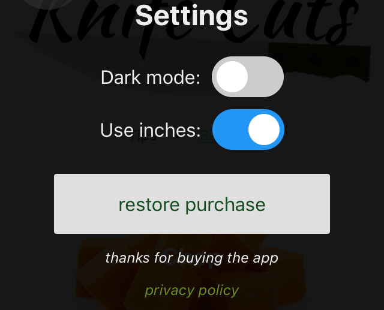
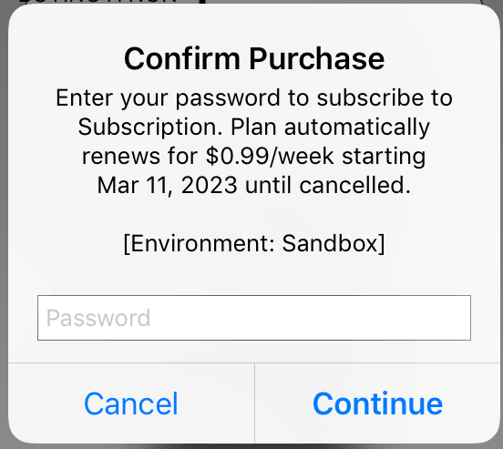
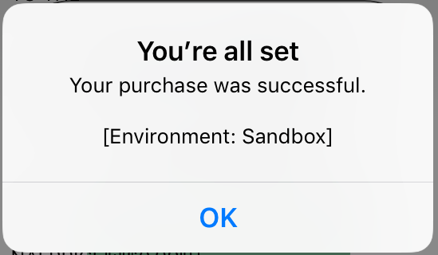

# Cordova-Plugin-InAppPurchases

# PLUGIN USAGE 

Calls should be done after cordova's `onDeviceReady` function is called.  
The plugin creates an `inAppPurchases` object for you to make calls to the store.  
The object is a promise-based API, click on each for more information on using the function. 

Add these calls inside of your cordova javascript to make in-app purchases and subscriptions:

### [`inAppPurchases.getAllProductInfo(productIds)`](getAllProductInfo.md)
- get a list of the products found on the app store for your app 
- use on the start up of the device (`onDeviceReady`) to edit UI and include prices from the app store
- on iOS make sure to use this when the device loads in `onDeviceReady` before calling the other requests to set up the API

 
<!---->
<!--
[`inAppPurchases.getPurchases()`](docs/getPurchases.md)
    - get a list of the purchased products from the app store 
    - use when device first loads in onDeviceReady, and onResume to update which products are currently owned
    - same as restore purchases, but does not prompt to log in
    - will not restore if the user is not logged in (Apple?), Apple recommends this as default, so the app does not prompt for login on each startup, when a user wants to stay logged out-->

### [`inAppPurchases.restorePurchases()`](restorePurchases.md)
- get a list of the purchased products from the app store 
- use when device first loads in `onDeviceReady`, and `onResume` to update which products are currently owned
- create a button, (for example in a settings section), called `restore` so that users can call this function themselves to restore their products, Apple requires a button

<!--prompts for login if they are not logged in-->

### [`inAppPurchases.purchase(productId)`](purchase.md)
- make a purchase (a one-time purchase or a subscription)
- when this is sucessful (and not pending), call completePurchase
- you can deliver the paid content right away after the first purchase call and revert it if the completePurchase fails, or deliver the paid content after the completePurchase goes through

### [`inAppPurchase.completePurchase(productId,consume)`](completePurchase.md)
- confirm the purchase
- use right after purchasing
- this "consumes" consumable products (able to buy it again) and "acknowledges" the products (if they are not acknowledged in Android, the purchase will be revoked after a few days)
- FYI: this function is only needed on Android, as on iOS purchases are consumed during the inAppPurcahses.purchase(productId) call

## Tips:
- wait for `deviceready` to fire before calling any functions
- after `deviceready`:
    - call [`inAppPurchases.getAllProductInfo(productIds)`](getAllProductInfo.md) to get all purchase info in your app and make the store ready on iOS
    - call [`inAppPurchases.restorePurchases()`](restorePurchases.md) next to retreive bought purchases
    - call [`inAppPurchases.completePurchase(purchase['productId'],this_product_id_is_consumable)`](completePurchase.md) on each purchase if it is no longer pending, but still not yet completed
- on `resume`:
    - call [`inAppPurchases.restorePurchases()`](restorePurchases.md) to get updates on bought purchases (for exmaple bought outside of the app) they may be no longer pending
    - call [`inAppPurchases.completePurchase(productId,this_product_id_is_consumable)`](completePurchase.md) on each purchase if it is no longer pending, but still not yet completed
- clicking buy buttons:
    - call [`inAppPurchases.purchase(productId)`](purchase.md)
    - call [`inAppPurchases.completePurchase(productId,this_product_id_is_consumable)`](completePurchase.md) on each purchase if not pending
- clicking restore buttons:
    - call [`inAppPurchases.restorePurchases()`](restorePurchases.md) to get log in and get purchases
- once it's set up errors can be ignored, and a few can be automatically retried after a timeout
- calls will error if they overlap (for example, onResume calls `restorePurchases` while a purchase is still completing), they can usually be ignored if you call to `restorePurchases` again to get updates
- since the API returns a promise, it is asynchronous... call it and continue with other actions, or await for it to finish from within an async function to wait for the call to finish. 

[go to main](../README.md#plugin-usage)

